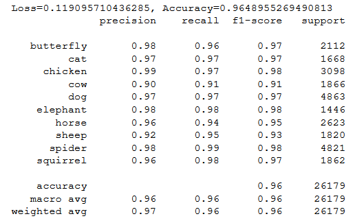
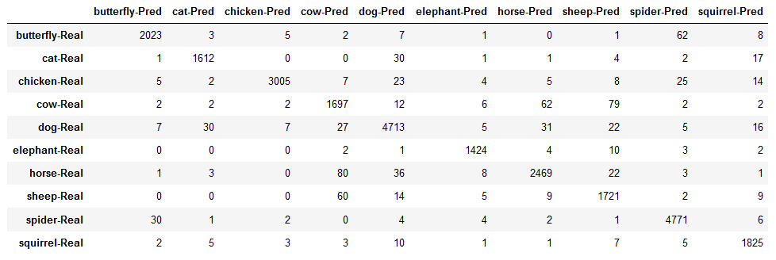

# Pytorch CNN model to classify Animal-10 Dataset using Resnet50 transfer Learning

## Dataset Description
It contains about 28K medium quality animal images belonging to 10 categories: dog, cat, horse, spyder, butterfly, chicken, sheep, cow, squirrel, elephant. All the images have been collected from "google images" and have been checked by human. The main directory is divided into folders, one for each category. Image count for each category varies from 2K to 5 K units.

## Results
77% of the whole data is used for training rest(23%) is used for Validation. The model is trained for 5 epochs on the training data.
#### Accuracy,Precision,Recall and F1-score

#### Confusion Matrix
